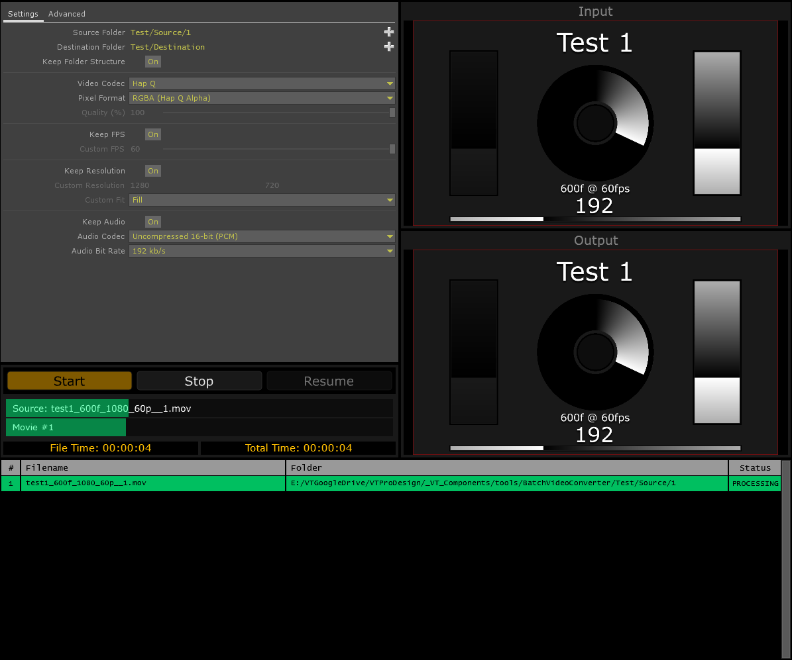
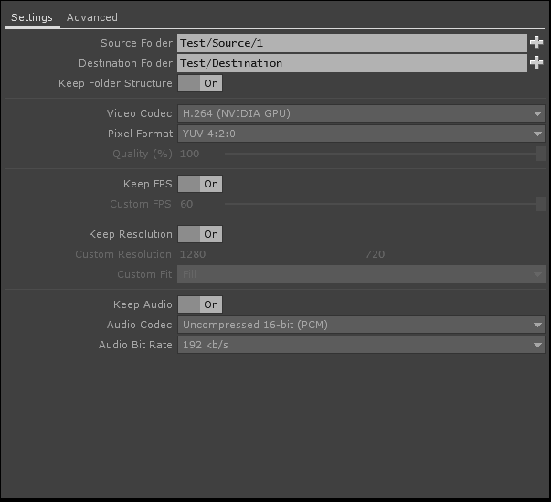
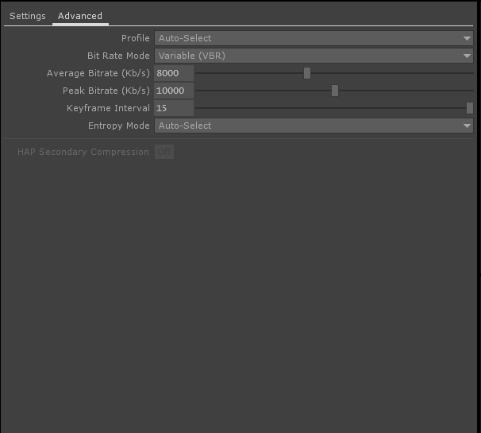

# td-batch-video-converter

**TouchDesigner** version **2019.20140**

This tool can be used to batch convert video files in a folder. It can also retain the folder structure of the input folder.

## Supported Codecs
	- Animation
	- Photo/Motion JPEG
	- MPEG 4 (Part 2)
	- H.264 (NVIDIA GPU)
 	- GoPro-Cineform
 	- Hap
 	- Hap Q
 	- H.265/HEVC (NVIDIA GPU)
 	- GIF

Just choose the source and destination folders and click the big start button.

Some additional codec codec controls can be found in the **Advanced** tab.

